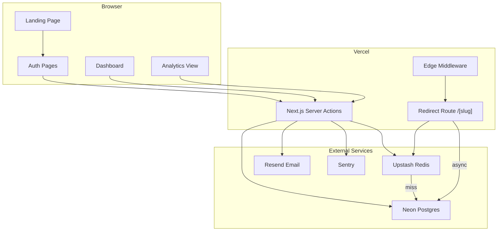
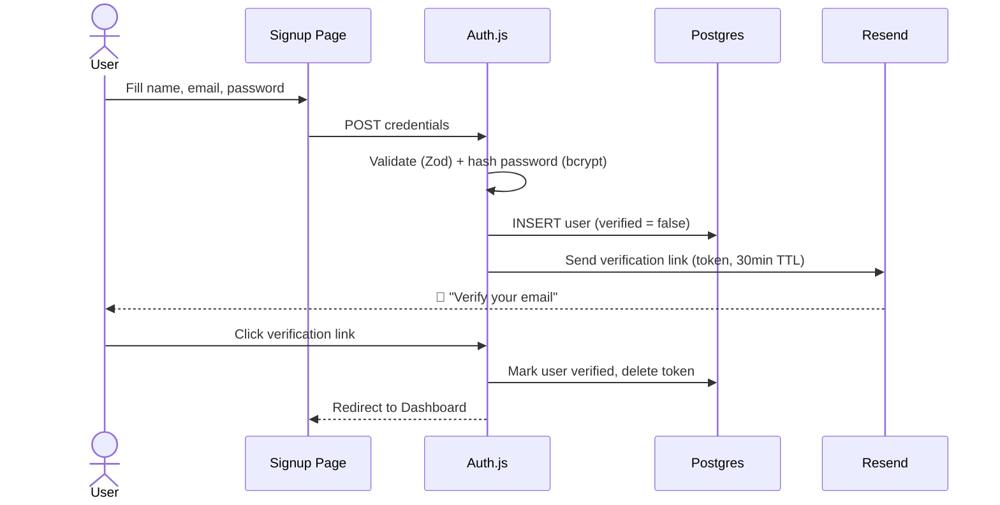
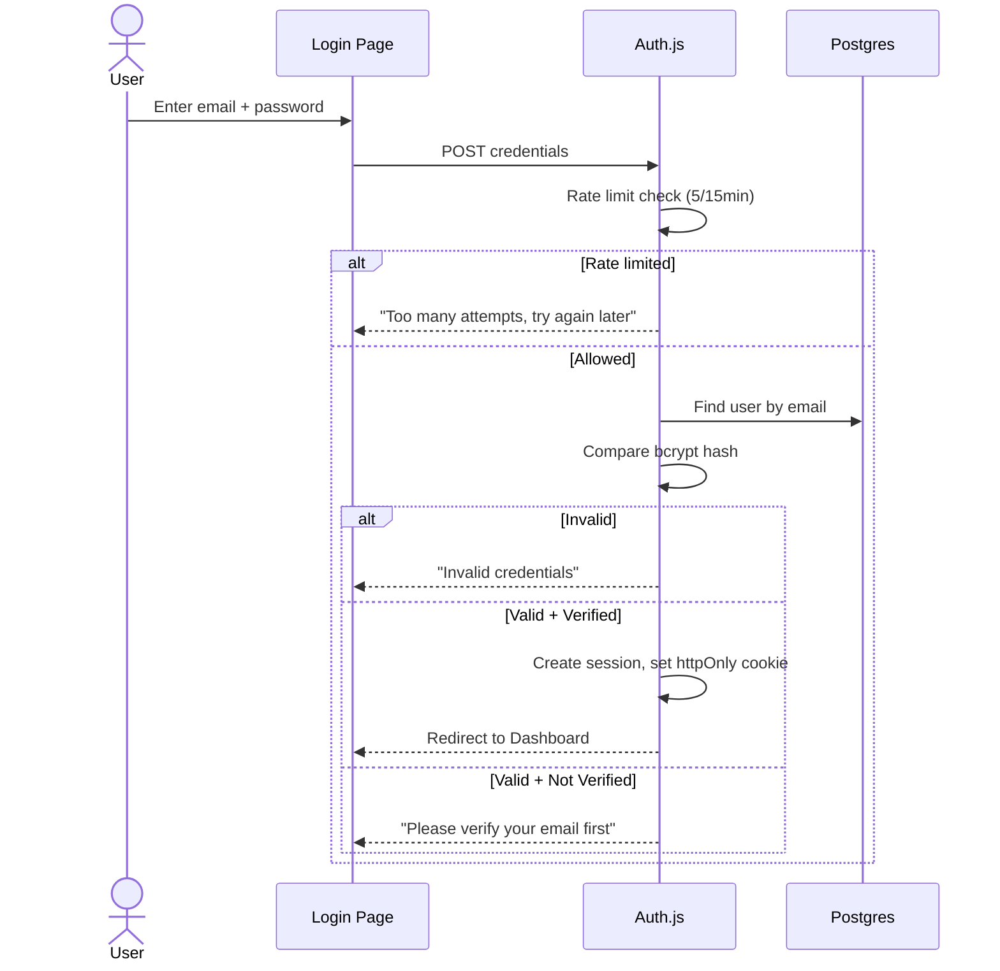
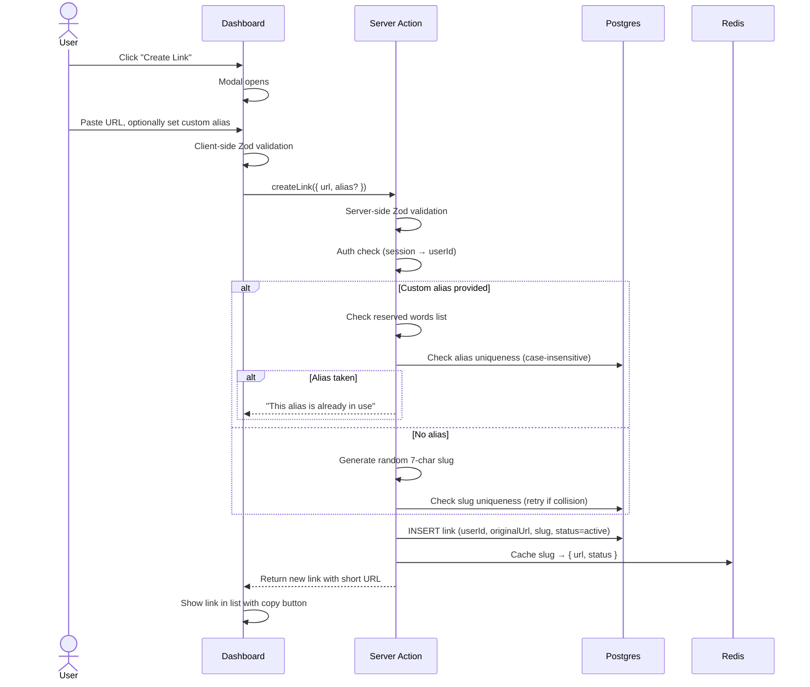
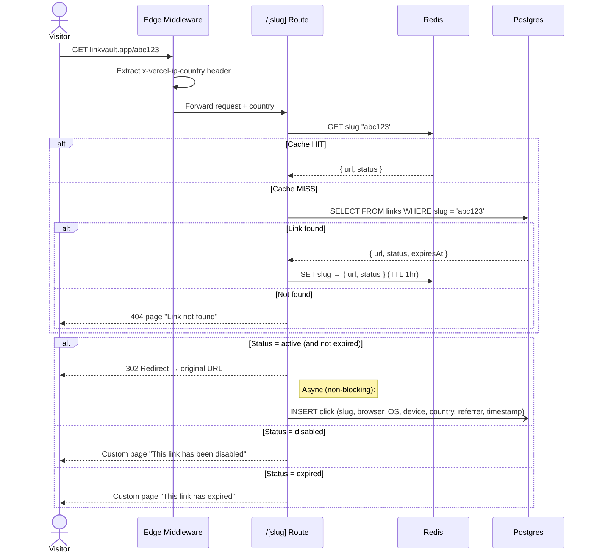
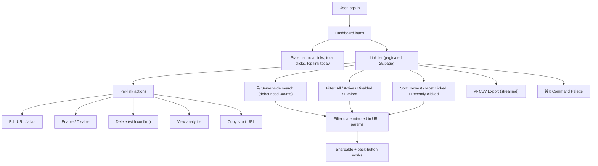
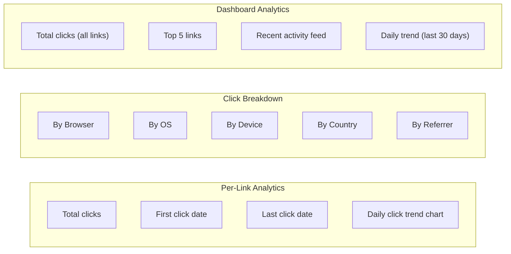
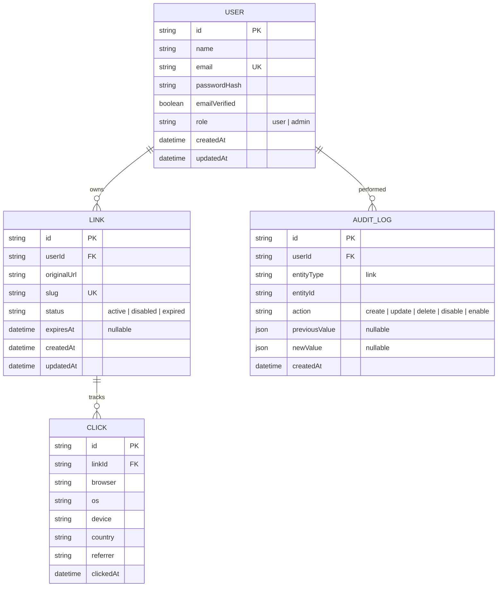

# LinkVault — App Flow

## High-Level System Architecture



---

## User Flows

### Flow 1: Signup & Email Verification



### Flow 2: Login



### Flow 3: Create Short Link (Core Feature)



### Flow 4: Redirect (The Critical Path)



> **Key design decision:** Click logging is fire-and-forget. The visitor gets their redirect in <50ms (cache hit). The click record is written async and never blocks the response.

### Flow 5: Dashboard Experience



### Flow 6: Analytics View



---

## Data Model



---

## Page Map

```
/                       → Landing page (public)
/login                  → Login form
/signup                 → Signup form
/verify-email           → Email verification handler
/forgot-password        → Password reset request
/reset-password         → Password reset form (with token)
/dashboard              → Link list + stats (protected)
/dashboard/new          → Create link modal/page
/dashboard/[id]         → Link detail + analytics (protected)
/dashboard/[id]/edit    → Edit link (protected, owner only)
/[slug]                 → Redirect route (public)
/[slug]/disabled        → "Link disabled" page
/[slug]/expired         → "Link expired" page
/404                    → Custom not found page
```

---

## Request Lifecycle Summary

```
Browser Request
    │
    ├─ Public pages (/, /login, /signup)
    │     → Server-rendered, no auth required
    │
    ├─ Protected pages (/dashboard/*)
    │     → Edge Middleware checks session cookie
    │     → No session? Redirect to /login
    │     → Valid session? Server Component fetches data (ownership-scoped queries)
    │
    └─ Redirect route (/[slug])
          → Edge Middleware extracts geo headers
          → Route handler: Redis → Postgres fallback
          → 302 redirect + async click log
```
