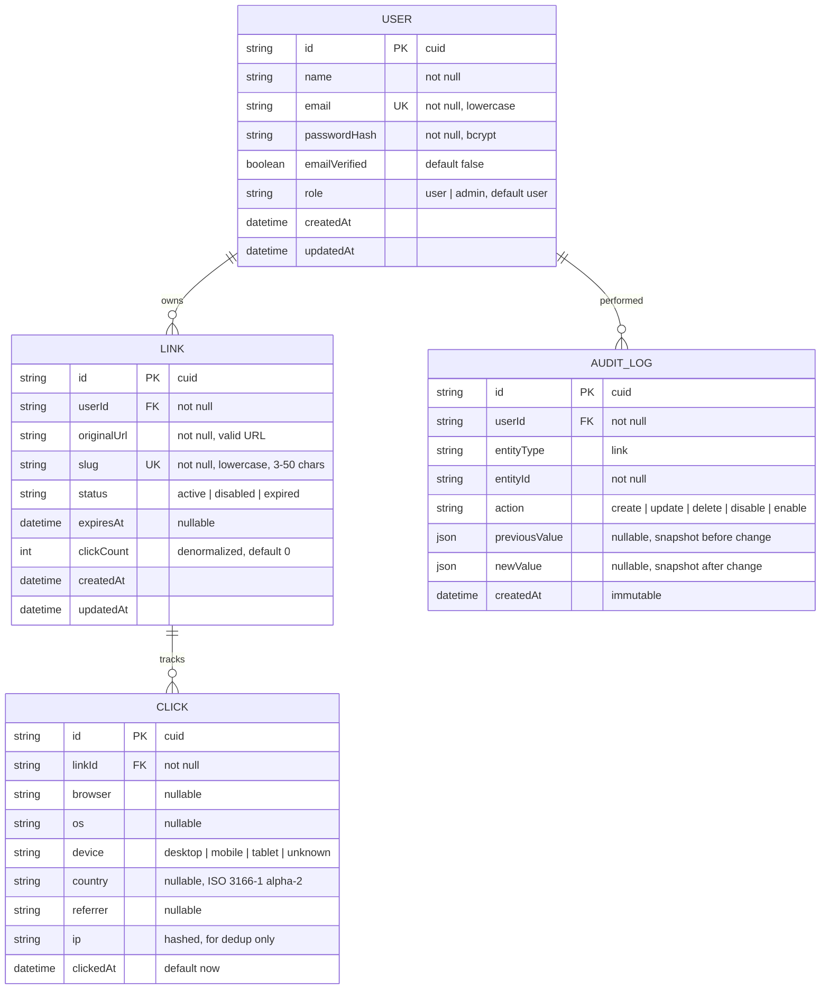
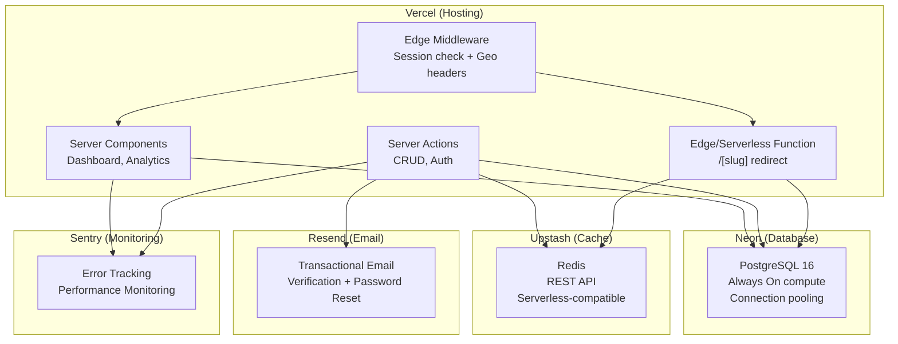

# LinkVault — Architecture

> Technical architecture for LinkVault, a branded URL shortener with analytics.
> This document covers system design, data model, key subsystems, and the rationale behind non-obvious decisions.

---

## Table of Contents

1. [System Overview](#system-overview)
2. [Data Model](#data-model)
3. [Auth Architecture](#auth-architecture)
4. [URL Shortening Engine](#url-shortening-engine)
5. [Redirect Service](#redirect-service)
6. [Analytics Pipeline](#analytics-pipeline)
7. [Caching Strategy](#caching-strategy)
8. [Security Model](#security-model)
9. [Infrastructure](#infrastructure)
10. [Key Design Decisions](#key-design-decisions)
11. [Performance Budget](#performance-budget)
12. [Scaling Roadmap](#scaling-roadmap)

---

## System Overview

```
┌─────────────────────────────────────────────────────────────────────┐
│                            BROWSER                                  │
│                                                                     │
│   Landing Page    Auth Pages    Dashboard    Analytics View          │
└────────┬──────────────┬────────────┬────────────┬───────────────────┘
         │              │            │            │
         ▼              ▼            ▼            ▼
┌─────────────────────────────────────────────────────────────────────┐
│                       VERCEL EDGE NETWORK                           │
│                                                                     │
│  ┌──────────────────────────────────────────────────────────────┐   │
│  │  Edge Middleware                                              │   │
│  │  • Session validation (redirect to /login if unauthenticated)│   │
│  │  • Extract x-vercel-ip-country for geo data                  │   │
│  │  • Rate limiting headers                                     │   │
│  └──────────────────────────────────────────────────────────────┘   │
│                                                                     │
│  ┌─────────────────────┐  ┌─────────────────────────────────────┐  │
│  │  /[slug] Route       │  │  Server Actions + API Routes        │  │
│  │  (Redirect Service)  │  │  (Dashboard, Auth, CRUD, Analytics) │  │
│  │                      │  │                                     │  │
│  │  Redis → Postgres    │  │  Auth.js sessions                   │  │
│  │  fallback lookup     │  │  Zod validation                     │  │
│  │  Async click logging │  │  Ownership-scoped queries           │  │
│  └──────────┬───────────┘  └──────────┬──────────────────────────┘  │
└─────────────┼──────────────────────────┼────────────────────────────┘
              │                          │
    ┌─────────┼──────────────────────────┼─────────┐
    │         ▼                          ▼         │
    │  ┌──────────────┐  ┌──────────────────────┐  │
    │  │ Upstash Redis │  │   Neon Postgres      │  │
    │  │ (Cache)       │  │   (Primary Store)    │  │
    │  │               │  │                      │  │
    │  │ Hot slug      │  │ Users, Links, Clicks │  │
    │  │ lookups       │  │ AuditLog, Sessions   │  │
    │  └──────────────┘  └──────────────────────┘  │
    │                                               │
    │  ┌──────────────┐  ┌──────────────────────┐  │
    │  │ Resend       │  │ Sentry               │  │
    │  │ (Email)      │  │ (Error Monitoring)   │  │
    │  └──────────────┘  └──────────────────────┘  │
    └───────────────────────────────────────────────┘
                    EXTERNAL SERVICES
```

The system follows a **serverless-first** architecture. There are no long-running processes, no VPS, and no containers. Every component is a managed service with a generous free tier.

---

## Data Model

### Entity Relationship Diagram



### Schema Design Notes

**User**
- `email` is stored lowercase and has a unique index. All lookups normalize to lowercase.
- `passwordHash` uses bcrypt (via Auth.js). Argon2id is preferable but bcrypt is Auth.js's default and sufficient for this scale.
- `role` is an enum (`user` | `admin`). Admin is a stub — it enables server-side RBAC checks without building a full admin panel.

**Link**
- `slug` has a unique, case-insensitive index (Postgres `CITEXT` or `LOWER()` index). All slugs are stored and compared lowercase.
- `clickCount` is **denormalized** — incremented on each click via an atomic `UPDATE ... SET clickCount = clickCount + 1`. This avoids `COUNT(*)` on the Click table for dashboard display. The source of truth remains the Click table; `clickCount` is a performance optimization.
- `status` transitions: `active ↔ disabled`, `active → expired` (via cron or on-read check). Deletion is a hard delete (with audit log entry created before deletion).

**Click**
- `ip` is hashed (SHA-256) and stored only for deduplication purposes if needed. Raw IPs are never stored.
- `country` comes from Vercel's `x-vercel-ip-country` header, extracted by Edge Middleware and passed to the click logging function.
- User-agent parsing (browser, OS, device) happens server-side using a lightweight UA parser before insert.

**AuditLog**
- Immutable — no UPDATE or DELETE operations. Append-only.
- `previousValue` and `newValue` store JSON snapshots of the entity before and after the change, enabling full change history reconstruction.

### Auth.js Tables

Auth.js v5 with Prisma adapter requires additional tables managed by the adapter:

| Table | Purpose |
|---|---|
| `Account` | OAuth provider accounts (not used with Credentials, but required by adapter schema) |
| `Session` | Server-side sessions tied to user |
| `VerificationToken` | Email verification and password reset tokens (single-use, TTL-bound) |

These are standard Auth.js tables — we don't customize their schema.

---

## Auth Architecture

### Stack

```
Auth.js v5 (NextAuth)
├── Credentials Provider (email + password)
├── Prisma Adapter (session + user persistence)
├── Resend (email verification + password reset)
└── bcrypt (password hashing)
```

### Auth Flow Overview

```mermaid
flowchart TD
    subgraph Signup
        S1["User submits email + password"]
        S2["Server validates with Zod"]
        S3["Hash password with bcrypt (12 rounds)"]
        S4["Insert User (emailVerified = false)"]
        S5["Generate verification token (32 bytes, SHA-256 hashed)"]
        S6["Store token in VerificationToken table (30min TTL)"]
        S7["Send email via Resend with verification link"]
        S8["User clicks link → verify token → set emailVerified = true"]
        S1 --> S2 --> S3 --> S4 --> S5 --> S6 --> S7 --> S8
    end

    subgraph Login
        L1["User submits email + password"]
        L2["Rate limit check (5 attempts / 15min per IP+email)"]
        L3["Find user by email"]
        L4["Compare bcrypt hash"]
        L5["Check emailVerified = true"]
        L6["Create session, set httpOnly cookie"]
        L1 --> L2 --> L3 --> L4 --> L5 --> L6
    end

    subgraph PasswordReset
        P1["User requests reset"]
        P2["Generate reset token (same as verification, 15min TTL)"]
        P3["Send email via Resend"]
        P4["User clicks link, submits new password"]
        P5["Validate token, hash new password, update User, delete token"]
        P6["Invalidate all existing sessions"]
        P1 --> P2 --> P3 --> P4 --> P5 --> P6
    end
```



### Session Management

- Sessions are stored server-side in Postgres (via Prisma adapter), not in JWTs.
- Session ID is sent to the client as an `httpOnly`, `Secure`, `SameSite=Lax` cookie.
- Sessions are rotated on login and on privilege change (password reset, role change).
- Session expiry: 30 days idle, absolute max 90 days.

### Authorization Model

```
Every protected server action / API route:
  1. Extract session from cookie (Auth.js getServerSession)
  2. If no session → 401
  3. If session but user.emailVerified === false → 403 (on write operations)
  4. Fetch the target resource
  5. If resource.userId !== session.user.id AND session.user.role !== 'admin' → 403
  6. Proceed
```

**Row-level ownership** is enforced in the Prisma query itself:

```typescript
// Every query is scoped to the authenticated user
const links = await prisma.link.findMany({
  where: { userId: session.user.id },
});
```

No role or user ID is ever trusted from the client. The server derives it from the session cookie on every request.

---

## URL Shortening Engine

### Slug Generation

```
Input: User provides a URL and optionally a custom alias.

Path A — Custom Alias:
  1. Normalize to lowercase
  2. Validate: 3–50 chars, alphanumeric + hyphens only, no leading/trailing hyphens
  3. Check against reserved words list (api, admin, dashboard, login, signup, etc.)
  4. Check uniqueness in DB (case-insensitive)
  5. If taken → return error with suggestion

Path B — Auto-generated:
  1. Generate 7-character slug from base62 charset (a-z, A-Z, 0-9)
  2. Lowercase the result
  3. Check uniqueness in DB
  4. If collision → regenerate (max 3 retries, then extend to 8 chars)
```

**Why 7 characters?** Base62^7 = ~3.5 trillion combinations. At the scale of this trial (hundreds of links), collision probability is effectively zero. The retry mechanism is a safety net, not an expected path.

### Reserved Words

A static list of path segments that must never be used as slugs:

```typescript
const RESERVED_SLUGS = [
  'api', 'admin', 'dashboard', 'login', 'signup', 'logout',
  'verify-email', 'forgot-password', 'reset-password',
  'settings', 'profile', 'health', 'status',
  'sitemap.xml', 'robots.txt', 'favicon.ico',
] as const;
```

### Validation (Shared Zod Schemas)

```typescript
// Used on BOTH client and server — single source of truth
export const createLinkSchema = z.object({
  url: z.string().url('Must be a valid URL').max(2048),
  alias: z
    .string()
    .min(3, 'Alias must be at least 3 characters')
    .max(50)
    .regex(/^[a-z0-9]([a-z0-9-]*[a-z0-9])?$/, 'Letters, numbers, and hyphens only')
    .optional(),
  expiresAt: z.coerce.date().min(new Date(), 'Expiry must be in the future').optional(),
});
```

---

## Redirect Service

This is the **most latency-sensitive path** in the entire application. Design goal: respond in <50ms on cache hit.

### Request Lifecycle

```
GET /abc123
  │
  ├─ 1. Edge Middleware
  │     • Extract x-vercel-ip-country → attach to request headers
  │
  ├─ 2. Route Handler (/[slug]/route.ts)
  │     • Read slug from params
  │
  ├─ 3. Cache Lookup (Redis)
  │     • GET cache:link:{slug}
  │     • HIT → parse cached value { originalUrl, status }
  │     • MISS → continue to step 4
  │
  ├─ 4. Database Lookup (Postgres, only on cache miss)
  │     • SELECT originalUrl, status, expiresAt FROM links WHERE slug = $1
  │     • NOT FOUND → return 404 page
  │     • FOUND → write to Redis (TTL 1 hour), continue
  │
  ├─ 5. Status Check
  │     • active + not expired → 302 Redirect to originalUrl
  │     • disabled → render "Link disabled" page
  │     • expired (or past expiresAt) → render "Link expired" page
  │
  └─ 6. Async Click Logging (fire-and-forget, NEVER blocks the redirect)
        • Parse User-Agent → browser, OS, device
        • Read country from forwarded header
        • Read referrer from Referer header
        • INSERT INTO clicks (...)
        • UPDATE links SET clickCount = clickCount + 1 WHERE id = $1
```

### Why Async Click Logging?

The redirect response is sent to the visitor **before** the click is written to the database. This is implemented using a pattern like:

```typescript
// Pseudocode — the visitor gets their redirect immediately
const response = NextResponse.redirect(link.originalUrl, 302);

// This runs after the response is sent (using waitUntil or similar)
event.waitUntil(logClick({
  linkId: link.id,
  browser: parsed.browser,
  os: parsed.os,
  device: parsed.device,
  country: geo.country,
  referrer: request.headers.get('referer'),
}));

return response;
```

**Trade-off:** If the click logging fails (DB write error), the click is lost. This is acceptable — redirect availability is more important than analytics accuracy. At production scale, you'd use a queue (Redis Streams, Kafka) for guaranteed delivery. For the trial, fire-and-forget is the right trade-off.

---

## Analytics Pipeline

### Data Collection

```
Click arrives via redirect route
  │
  ├─ User-Agent parsing (lightweight library, e.g., ua-parser-js)
  │     → browser: "Chrome 120"
  │     → os: "macOS 14"
  │     → device: "desktop"
  │
  ├─ Geo extraction
  │     → country: "US" (from x-vercel-ip-country header)
  │
  ├─ Referrer extraction
  │     → referrer: "twitter.com" (from Referer header, domain only)
  │
  └─ Write to Click table
```

### Aggregation Queries

Analytics are computed **on read** from the Click table, not pre-aggregated. This is simpler and sufficient at trial scale.

| Metric | Query Approach |
|---|---|
| Total clicks per link | Read denormalized `clickCount` from Link table |
| Clicks over time (daily) | `GROUP BY DATE(clickedAt)` with date range filter |
| Browser breakdown | `GROUP BY browser`, `COUNT(*)`, `ORDER BY count DESC LIMIT 10` |
| OS breakdown | `GROUP BY os`, same pattern |
| Device breakdown | `GROUP BY device` (only 4 values: desktop, mobile, tablet, unknown) |
| Country breakdown | `GROUP BY country`, same pattern |
| Referrer breakdown | `GROUP BY referrer`, same pattern |
| Top links | `ORDER BY clickCount DESC LIMIT 5` on Link table |

### Why Not Pre-Aggregation?

At trial scale (hundreds of links, thousands of clicks), `GROUP BY` queries on indexed columns return in <50ms. Pre-aggregation (materialized views, rollup tables) adds schema complexity and consistency concerns without a measurable latency benefit. The architecture doc notes this as a **scaling decision** — at 1M+ clicks, you'd introduce time-bucketed rollup tables or move analytics to ClickHouse.

---

## Caching Strategy

### What's Cached

Only one thing: **slug → link data** for the redirect path.

```
Redis Key:    cache:link:{slug}
Redis Value:  JSON { originalUrl, status, expiresAt }
TTL:          1 hour
```

### Cache Invalidation Contract

| Event | Action |
|---|---|
| Link created | `SET cache:link:{slug}` |
| Link URL updated | `DEL cache:link:{slug}` (next read repopulates) |
| Link disabled/enabled | `DEL cache:link:{slug}` |
| Link deleted | `DEL cache:link:{slug}` |
| Link slug changed | `DEL cache:link:{oldSlug}` + `SET cache:link:{newSlug}` |

**Invalidation is synchronous** — it happens inside the same server action that mutates the link, before the response is returned. This guarantees no stale reads after a mutation (at the cost of slightly slower writes, which is the correct trade-off).

### Cache Miss Behavior

```
1. Redis GET returns null
2. Query Postgres
3. If found → write to Redis with 1hr TTL, return data
4. If not found → return 404 (do NOT cache the miss — prevents cache poisoning)
```

### Why Not Cache Negative Results?

Caching "not found" results risks a situation where a user creates a new link with a slug that was recently looked up and cached as missing. The cache would return 404 until TTL expires, even though the link now exists. At trial scale, the uncached 404 lookup costs ~10ms — not worth the complexity.

---

## Security Model

### Defense in Depth

| Threat | Mitigation |
|---|---|
| **SQL Injection** | All queries via Prisma (parameterized). No raw SQL. |
| **XSS** | React's auto-escaping. No `dangerouslySetInnerHTML`. CSP header blocks inline scripts. |
| **CSRF** | Auth.js built-in CSRF protection. Server Actions use the same origin check. All mutations require POST. |
| **Session Hijacking** | `httpOnly` + `Secure` + `SameSite=Lax` cookies. Sessions rotated on privilege changes. Server-side session storage (not JWT). |
| **Brute Force** | Rate limiting on auth endpoints (5 attempts / 15min per IP+email). Exponential backoff. |
| **Open Redirect** | Redirects only to URLs stored in the database by authenticated users. No user-supplied redirect targets in query params. |
| **Information Leakage** | User-facing errors are generic ("something went wrong"). Full stack traces go to server logs + Sentry only. No secret keys in `NEXT_PUBLIC_` vars. |

### Security Headers

```typescript
// next.config.js headers
{
  'Content-Security-Policy': "default-src 'self'; script-src 'self'; style-src 'self' 'unsafe-inline';",
  'Strict-Transport-Security': 'max-age=63072000; includeSubDomains; preload',
  'X-Content-Type-Options': 'nosniff',
  'X-Frame-Options': 'DENY',
  'Referrer-Policy': 'strict-origin-when-cross-origin',
  'Permissions-Policy': 'camera=(), microphone=(), geolocation=()',
}
```

---

## Infrastructure



### Why These Services?

| Service | Why | Alternative Considered |
|---|---|---|
| **Vercel** | Brief requires it. Auto-deploy, preview URLs, Edge Runtime. | Netlify (brief allows it, but Vercel has better Next.js support) |
| **Neon** | Serverless Postgres that works with Vercel. Free tier includes "Always On" compute for one project. | Supabase (heavier, includes auth we don't need), PlanetScale (MySQL, not Postgres) |
| **Upstash** | Serverless Redis with REST API — no persistent connections needed. Works in Edge Runtime. | Vercel KV (built on Upstash, same thing with a wrapper) |
| **Resend** | Best DX for transactional email. 100/day free. HTTP API works in Edge. | Nodemailer + SMTP (documented as fallback), SendGrid (dated DX) |
| **Sentry** | Industry standard error tracking. Free tier generous. | Vercel built-in (less detailed), LogRocket (heavier) |

---

## Key Design Decisions

### 1. Server-Side Sessions vs. JWTs

**Decision:** Server-side sessions stored in Postgres.

**Why:** JWTs can't be revoked without a blocklist (which is just a session store with extra steps). Server-side sessions allow immediate revocation on password reset, role change, or suspicious activity. The latency cost of a DB lookup per request is negligible given Neon's proximity to Vercel's edge.

### 2. Denormalized Click Count vs. COUNT(*)

**Decision:** Store `clickCount` on the Link table, increment atomically on each click.

**Why:** The dashboard's link list shows click counts for every link. Running `COUNT(*)` on the Click table for each link in a paginated list generates N+1 queries or requires a subquery/join. A denormalized counter on the Link table makes the list query a simple `SELECT` with no join. The Click table remains the source of truth for analytics; `clickCount` is a read optimization.

**Trade-off:** If the async click log fails, the counter and actual clicks diverge. Acceptable at trial scale. A reconciliation job could fix drift, but YAGNI.

### 3. Cursor Pagination vs. Offset Pagination

**Decision:** Cursor-based pagination using the link's `createdAt` + `id` as the cursor.

**Why:** Offset pagination (`SKIP N`) degrades at high page numbers because the database still scans and discards N rows. Cursor pagination (`WHERE createdAt < cursor ORDER BY createdAt DESC LIMIT 25`) uses an index seek and performs consistently regardless of page depth. It also handles concurrent inserts gracefully — no shifted rows when new links are created while paginating.

**Trade-off:** No "jump to page N" — only next/previous. This is standard for feed-style UIs and matches the dashboard's interaction model.

### 4. On-Read Expiry Check vs. Cron Job

**Decision:** Check `expiresAt` at redirect time and on dashboard load, not via a background cron.

**Why:** Vercel doesn't natively support cron jobs (Vercel Cron exists but adds complexity). Checking expiry on read is simpler and sufficient — a link that's expired but not yet marked as such will be caught on the next read. The only edge case is cache: an expired link cached in Redis would still redirect until the cache TTL expires (max 1 hour). Acceptable trade-off.

### 5. Single Branded OG Image vs. Dynamic Per-Link OG

**Decision:** One branded OG image for app pages. No dynamic OG for shortened URLs.

**Why:** Shortened URLs are redirect endpoints (302), not pages that render in the browser. Social platforms follow the redirect and use the *destination* page's OG image, not the shortener's. Generating dynamic OG images for redirect URLs would never be seen by anyone. The app pages (landing, dashboard, login) get a single, well-designed branded image.

### 6. Fire-and-Forget Click Logging vs. Guaranteed Delivery

**Decision:** Fire-and-forget (no queue).

**Why:** Redirect latency is the user-visible metric. Click analytics are internal. Losing a small percentage of clicks due to transient DB write failures is acceptable. At production scale, you'd introduce Redis Streams or a message queue for guaranteed delivery. For the trial, the complexity of a queue is not justified.

---

## Performance Budget

| Operation | Target | Approach |
|---|---|---|
| Redirect (cache hit) | < 50ms | Redis GET → 302 response. No DB call. |
| Redirect (cache miss) | < 200ms | Postgres SELECT → Redis SET → 302 response. |
| Dashboard load | < 500ms | Server Component. Cursor-paginated query. Denormalized click counts. |
| Create short link | < 300ms | Zod validate → DB INSERT → Redis SET. |
| Auth actions | < 500ms | Auth.js handles. bcrypt comparison is the bottleneck (~250ms at 12 rounds). |
| LCP | < 2.5s | Server-rendered landing page. No client-side data fetching on initial load. |
| INP | < 200ms | Minimal client-side JavaScript. Server Actions for mutations. |
| CLS | < 0.1 | Skeleton loaders match final layout dimensions. No layout shifts from async content. |

---

## Scaling Roadmap

> **Not in scope for the trial.** Documented here to show awareness of future scaling needs.

| Scale Trigger | Architectural Change |
|---|---|
| **1K+ links** | Add composite index on `(userId, status, createdAt)` for filtered dashboard queries |
| **100K+ clicks** | Move analytics to time-bucketed rollup tables, aggregate hourly via Vercel Cron |
| **1M+ clicks** | Migrate analytics to ClickHouse (columnar store optimized for aggregation) |
| **10K+ req/sec on redirects** | Move redirect to Edge Runtime with `@neondatabase/serverless` (no connection pooling needed) |
| **Multi-region** | Deploy Postgres read replicas near edge locations. Redis already global via Upstash. |
| **Team workspaces** | Add Organization and Membership tables. Scope queries to org instead of user. |

---

**End of Document**
